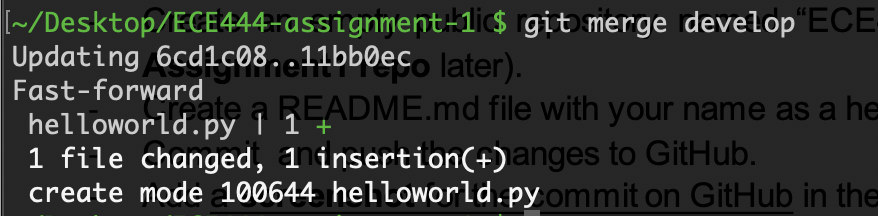

# Himanish Jindal

Screenshot of Commit on GitHub

Screenshot of the Output of the Merge Command

Screenshot of successful merge in PR: 

Screenshot of creating utils class:

Screenshot of creating unit tests:

Git Rebase Screenshots:
Normal Rebase:

Fixing Rebase using interactive rebase:

